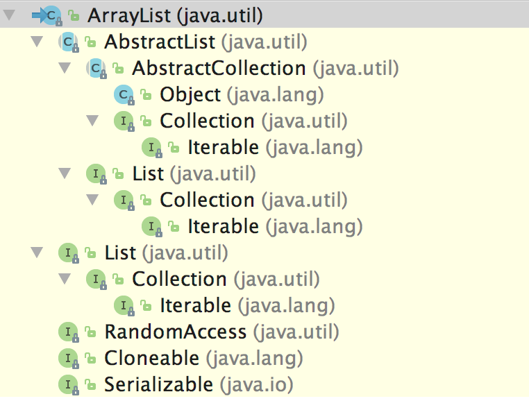
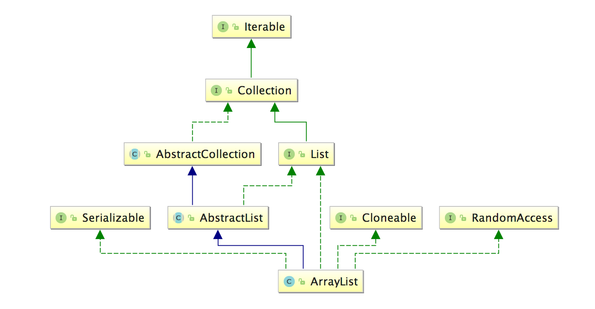

# 线性表-顺序表-ArrayList

`ArrayList` 类是 `List` 接口的可调整大小的数组实现，是具有顺序存储结构的线性表。它实现了所有可选的列表操作，并且允许存储包括 `null` 值在内的所有元素。除了实现 `List` 接口外，此类还提供了一些方法来操作内部用于存储列表元素的数组的大小。（这个类大致相当于 `Vector` 类，除了**它不是同步的**）。

`set`、`isEmpty`、`get`、`set`、`iterator` 和 `listIterator` 操作都以**固定时间（constant time）** 运行，即时间复杂度为**O(1)**。`add` 操作以**分摊的常量时间（amortized constant time）** 运行，即添加 n 个元素需要**O(n)** 的时间复杂度。其他所有操作都以**线性时间（linear time）** 运行（大体上讲）。与用于 `LinkList` 实现的常数因子相比，此实现的常数因子较低。

在添加大量元素前，应用程序可以使用 `ensureCapacity` 操作来增加 `ArrayList` 实例的容量，这样可以减少**递增式再分配内存（incremental reallocation）** 的次数。

**注意，此实现不是同步的（not synchronized）**。如果多个线程同时访问了一个 `ArrayList` 实例，而其中至少一个线程在结构修改了该列表，则**必须在外部进行同步**。（结构上的修改是指任何添加或删除一个或多个元素的操作，或者显示调整底层数组的大小；仅仅设置元素的值不是结构上的修改。）这通常通过同步一些自然封装的对象来实现。如果不存在此类对象，则应使用 `Collections.synchronizedList` 方法来包装该列表。这最好在创建列表时完成，以防止意外地对列表进行不同步的访问：

```java
    List list = Collections.synchronizedList(new ArrayList(...));
```

此类的 `iterator` 和 `listIterator` 方法返回的迭代器是**快速失败（fail-fast）** 的：在创建迭代器之后，除非通过迭代器自身的 `remove` 或 `add` 方法从结构上对列表进行修改，否则在任何时间以任何方式对列表进行修改，迭代器都会抛出 `ConcurrentModificationException`。因此，面对并发的修改，迭代器很快就会**完全失败（fails quickly and cleanly）**，而不是冒着在将来某个不确定的时间发生任意不确定行为的风险。

> 注意，迭代器的快速失败行为无法得到保证，因为一般来说，在存在不同步的并发修改时，不可能做出任何硬性保证（hard guarantees）。快速失败迭代器会尽最大努力抛出 `ConcurrentModificationException`。因此，为提高这类迭代器的正确性而编写一个依赖于此异常的程序是错误的做法：迭代器的快速失败行为应该仅用于**检测bug**。

## ArrayList相关图

类型层次：



类图关系：



## 基本定义和字段

```java
public class ArrayList<E> extends AbstractList<E>
        implements List<E>, RandomAccess, Cloneable, java.io.Serializable
{
    private static final long serialVersionUID = 8683452581122892189L;

    private static final int DEFAULT_CAPACITY = 10;

    private static final Object[] EMPTY_ELEMENTDATA = {};

    private static final Object[] DEFAULTCAPACITY_EMPTY_ELEMENTDATA = {};

    transient Object[] elementData; // non-private to simplify nested class access

    private int size;

    public ArrayList(int initialCapacity) {
        if (initialCapacity > 0) {
            this.elementData = new Object[initialCapacity];
        } else if (initialCapacity == 0) {
            this.elementData = EMPTY_ELEMENTDATA;
        } else {
            throw new IllegalArgumentException("Illegal Capacity: "+
                                               initialCapacity);
        }
    }

    public ArrayList() {
        this.elementData = DEFAULTCAPACITY_EMPTY_ELEMENTDATA;
    }

    public ArrayList(Collection<? extends E> c) {
        elementData = c.toArray();
        if ((size = elementData.length) != 0) {
            // c.toArray might (incorrectly) not return Object[] (see 6260652)
            if (elementData.getClass() != Object[].class)
                elementData = Arrays.copyOf(elementData, size, Object[].class);
        } else {
            // replace with empty array.
            this.elementData = EMPTY_ELEMENTDATA;
        }
    }
}
```

静态字段解析：

- `DEFAULT_CAPACITY（int类型）`：底层数组缓冲区的默认初始化容量（值为10）；
- `EMPTY_ELEMENTDATA（Object[]类型）`：共享的空数组实例。用于 `ArrayList(int initialCapacity)` 构造函数使用，在参数 `initialCapacity` 为 0 的情况下，数组缓冲区设置为该空数组实例。
- `DEFAULTCAPACITY_EMPTY_ELEMENTDATA（Object[]类型）`：共享的空数组实例。用于 `ArrayList` 默认无参构造函数，创建一个空列表 `ArrayList`。我们将此与 `EMPTY_ELEMENTDATA` 区别开来，在填充第一个元素时，会进行 `elementData == DEFAULTCAPACITY_EMPTY_ELEMENTDATA` 的判断，以便进行数组的扩充。

实例字段解析：

- `elementData（transient Object[]类型）`：包级私有（package-private）的访问权限，简化嵌套类的访问，存储 `ArrayList` 的数据元素的数组缓冲区，`ArrayList` 的容量大小为该数组缓冲区的长度。任何具有 `elementData == DEFAULTCAPACITY_EMPTY_ELEMENTDATA` 的空 `ArrayList` （即采用无参构造函数创建的ArrayList）在填充第一个元素时，都将扩充为容量为 `DEFAULT_CAPACITY` （值为10）的新数组。
- `size（int类型）`：`ArrayList` 包含的数据元素的数量。

构造函数解析：

- `ArrayList()`：使用静态字段 `DEFAULTCAPACITY_EMPTY_ELEMENTDATA` 表示的空数组初始化实例字段`elementData`表示的数组缓冲区；
- `ArrayList(int initialCapacity)`：使用传入参数 `initialCapacity` 的值初始化存储数据元素的数据缓冲区 `elementData`；`initialCapacity` 的值为 0 时，使用静态字段 `EMPTY_ELEMENTDATA` 表示的空数组初始化该数组缓冲区；
- `ArrayList(Collection<? extends E> c)`：使用包含数据元素的指定集合来初始化数组缓冲区，数据缓冲区中的元素存储顺序为集合元素迭代器返回的数据元素的顺序。

## 基本运算

### 求表长

每个 `ArrayList` 实例包含实例字段 `size` 表示该实例所存储的数据元素的数量，因此求表长的时间复杂度为 `O(1)`。

```java
    public int size() {
        return size;
    }
```


### 增加新元素

表尾插入新元素：数组的索引可以直接定位到要插入的位置，因此在表尾插入单个新元素的时间复杂度为**O(1)**。

```java
    public boolean add(E e) {
        ensureCapacityInternal(size + 1);  // Increments modCount!!
        elementData[size++] = e;
        return true;
    }
```

指定位置插入新元素：在数组的指定位置插入新元素，需先将指定位置右侧的所有数据元素依次向右移动一个位置，移动完成后，再在指定位置插入新元素。该操作**平均移动次数约为n/2**，其时间复杂度是**O(n)**。

```java
    public void add(int index, E element) {
        rangeCheckForAdd(index);

        ensureCapacityInternal(size + 1);  // Increments modCount!!
        System.arraycopy(elementData, index, elementData, index + 1,
                         size - index);
        elementData[index] = element;
        size++;
    }
```

批量插入新元素 `addAll(Collection<? extends E> c)` 和在指定位置批量插入新元素 `addAll(int index, Collection<? extends E> c)` 分析同上。

#### 增加新元素-扩充表空间

在上面的增加新元素的操作中，首先都要判断容纳数据元素的数组缓冲区的空间是否足够，如果不能满足新增元素的需求，都需要创建新的数组缓冲区，容量为原数组缓冲区容量的 **1.5** 倍，然后拷贝原数据元素到新的数组缓冲区中，最后在指定位置增加新元素。扩充表空间的逻辑如下：

```java
    private void grow(int minCapacity) {
        // overflow-conscious code
        int oldCapacity = elementData.length;
        // 新的空间容量 = 1.5 倍的旧空间的容量
        int newCapacity = oldCapacity + (oldCapacity >> 1);
        if (newCapacity - minCapacity < 0)
            newCapacity = minCapacity;
        if (newCapacity - MAX_ARRAY_SIZE > 0)
            // 最大空间容量为 Integer.MAX_VALUE 的值 0x7fffffff = 2<sup>31</sup> - 1
            newCapacity = hugeCapacity(minCapacity);
        // minCapacity is usually close to size, so this is a win:
        elementData = Arrays.copyOf(elementData, newCapacity);
    }
```

### 读取元素

按索引读取元素：直接操作底层的数组缓冲区，使用索引直接获取数据，时间复杂度为**O(1)**。

```java
    @SuppressWarnings("unchecked")
    E elementData(int index) {
        return (E) elementData[index];
    }

    public E get(int index) {
        rangeCheck(index);

        return elementData(index);
    }
```

查找指定元素第一次出现的索引值：从前往后遍历底层数组缓冲区，每个元素进行比较，直到找到第一个匹配的元素，返回该元素的索引。如果没有找到匹配的元素，返回 -1。其时间复杂度为**O(n)**。

```java
    public int indexOf(Object o) {
        if (o == null) {
            for (int i = 0; i < size; i++)
                if (elementData[i]==null)
                    return i;
        } else {
            for (int i = 0; i < size; i++)
                if (o.equals(elementData[i]))
                    return i;
        }
        return -1;
    }
```

查找指定元素最后一次出现的索引值：从后往前遍历底层数组缓冲区，每个元素进行比较，直到找到第一个匹配的元素，返回该元素的索引。如果没有找到匹配的元素，返回 -1。其时间复杂度为**O(n)**。

```java
    public int lastIndexOf(Object o) {
        if (o == null) {
            for (int i = size-1; i >= 0; i--)
                if (elementData[i]==null)
                    return i;
        } else {
            for (int i = size-1; i >= 0; i--)
                if (o.equals(elementData[i]))
                    return i;
        }
        return -1;
    }
```

### 删除元素

删除指定索引的数据元素：需要将指定索引后数据元素，依次向前移动1个位置，元素**平均移动次数为(n-1)/2**，时间复杂度为**O(n)**。Java方法采用 `native` 方法 `System.arraycopy` 实现元素的移动，且移动完成后，将最后一个位置的元素设置为 `null` 值，以便垃圾回收器可以回收该空间。

```java
    public E remove(int index) {
        rangeCheck(index);

        modCount++;
        E oldValue = elementData(index);

        int numMoved = size - index - 1;
        if (numMoved > 0)
            System.arraycopy(elementData, index+1, elementData, index,
                             numMoved);
        elementData[--size] = null; // clear to let GC do its work

        return oldValue;
    }
```

删除列表中第一次出现的指定元素：先遍历查找匹配元素的索引，找到匹配的索引后的逻辑同上述**删除指定索引的数据元素**的逻辑一致。

```java
    public boolean remove(Object o) {
        if (o == null) {
            for (int index = 0; index < size; index++)
                if (elementData[index] == null) {
                    fastRemove(index);
                    return true;
                }
        } else {
            for (int index = 0; index < size; index++)
                if (o.equals(elementData[index])) {
                    fastRemove(index);
                    return true;
                }
        }
        return false;
    }

    private void fastRemove(int index) {
        modCount++;
        int numMoved = size - index - 1;
        if (numMoved > 0)
            System.arraycopy(elementData, index+1, elementData, index,
                             numMoved);
        elementData[--size] = null; // clear to let GC do its work
    }
```

## 嵌套类

### 私有迭代器类 Itr

私有嵌套类 `Itr` 实现接口 `Iterator<E>`，是 `AbstractList.Itr` 的优化版本。

#### 基本定义和字段

```java
    private class Itr implements Iterator<E> {
        int cursor;       // index of next element to return
        int lastRet = -1; // index of last element returned; -1 if no such
        int expectedModCount = modCount;
    }
```

实例字段解析：

- `cursor（int类型）`：返回下一个元素的索引，默认从 0 开始；
- `lastRet（int类型）`：迭代器返回的最后一个元素的索引，**-1** 表示刚调用了一次 `Itr` 实例的 `remove()` 方法；
- `expectedModCount（int类型）`：存储`Itr`实例化时 `modCount` 的值，用于判断外围类 `ArrayList` 实例是否发生结构性的更改。在重载 `remove` 方法中删除元素后，会重新设置 `expectedModCount` 的值为外围类实例 `ArrayList` 当前 `modCount` 的值。

### 私有列表迭代器类 ListItr

私有嵌套类 `ListItr` 扩展了私有嵌套类 `Itr`，并实现了接口 `ListIterator<E>`，是 `AbstractList.ListItr` 的优化版本。

#### 基本定义和字段

```java
    private class ListItr extends Itr implements ListIterator<E> {
        ListItr(int index) {
            super();
            cursor = index;
        }
    }
```

实例字段只有超类 `Itr` 的实例字段，详情参考上述内容。

构造函数解析：

- `ListItr(int index)`：该构造函数会根据传入的参数 `index` 设置字段 `cursor` 的值，指定了要返回的下一个元素的索引。

### 私有子列表类 SubList

私有嵌套类 `SubList` 扩展了抽象类 `AbstractList<E>`，并实现了标记接口 `RandomAccess`。该类实际操作的是传入其构造函数的外围类的实例，它对其外围类进行了包装，相当于一个包装类（wrapper class）。

#### 基本定义和字段

```java
    private class SubList extends AbstractList<E> implements RandomAccess {
        private final AbstractList<E> parent;
        private final int parentOffset;
        private final int offset;
        int size;

        SubList(AbstractList<E> parent,
                int offset, int fromIndex, int toIndex) {
            this.parent = parent;
            this.parentOffset = fromIndex;
            this.offset = offset + fromIndex;
            this.size = toIndex - fromIndex;
            this.modCount = ArrayList.this.modCount;
        }
    }
```

实例字段解析：

- `parent（final AbstractList<E>类型）`：存储和当前 `SubList` 实例的父列表实例，和其外围类进行显示关联；
- `parentOffset（final int类型）`：父列表实例的开始索引；
- `offset（final int类型）`： `SubList` 实例操作的偏移量（构造函数传入的参数 `offset + fromIndex` 之和）；
- `size（int类型）`：`SubList` 实例的大小。
