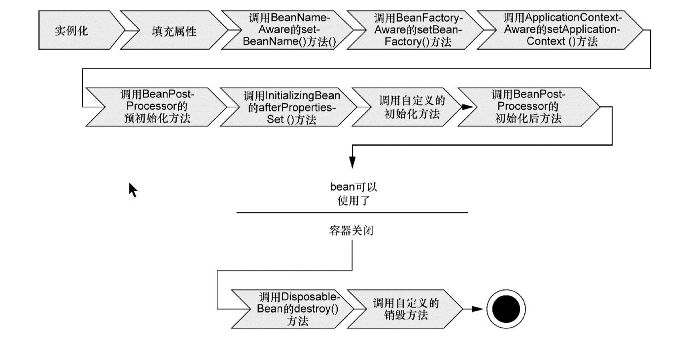

# spring容器

spring自带了多个容器实现，可以归为两种不同的类型：

- `BeanFactory`是最简单的容器，提供基本的DI支持。
- `ApplicationContext`基于`BeanFactory`构建，并提供应用框架级别的服务。

spring自带的几种常用的应用上下文`ApplicationContext`如下：

- `AnnotationConfigApplicationContext`：从一个或多个基于java的配置类中加载spring应用上下文。
- `AnnotationConfigWebApplicationContext`：从一个或多个基于java的配置类中加载spring web应用上下文。
- `ClassPathXmlApplicationContext`：从类路径下的一个或多个xml配置文件中加载上下文定义，把应用上下文的定义文件作为类资源。
- `FileSystemXmlApplicationContext`：从文件系统下的一个或多个xml配置文件种加载上下文定义。
- `XmlWebApplicationContext`：从web应用下的一个或多个xml配置文件中加载上下文定义。

## spring容器中bean的生命周期

spring容器中bean的生命周期相对比较复杂，下图展示了bean装载到spring应用上下文中的一个典型的生命周期过程：



生命周期的详细描述如下：

- Spring对bean进行实例化，即执行构造函数;
- Spring将值和**bean的引用注入**到bean对应的属性中； 
- 如果bean实现了`BeanNameAware`接口，Spring将bean的ID传递给`setBean-Name()`方 法； 
- 如果bean实现了`BeanFactoryAware`接口，Spring将调用`setBeanFactory()`方法，将 `BeanFactory`容器实例传入；
- 如果bean实现了`ApplicationContextAware`接口，Spring将调 用s`etApplicationContext()方`法，将bean所在的应用上下文的引用传入进来；
- 如果bean实现了`BeanPostProcessor`接口，Spring将调用它们的`postProcessBeforeInitialization()`方法；
- 如果bean实现了`InitializingBean`接口，Spring将调用它们的`afterPropertiesSet()`方法。类似地，如果bean使用`init-method`声明了初始化方法，该方 法也会被调用；
- 如果bean实现了`BeanPostProcessor`接口，Spring将调用它们的`postProcessAfterInitialization()`方法；
- 此时，bean已经准备就绪，可以被应用程序使用了，它们将一直驻留在应用上下文中， 直到该应用上下文被销毁；
- 如果bean实现了`DisposableBean`接口，Spring将调用它的`destroy()`接口方法。同 样，如果bean使用`destroy-method`声明了销毁方法，该方法也会被调用。

## 装配Bean

Spring提供了三种主要的装配机制：

- 在XML中进行显示配置
- 在Java代码中进行显示配置
- 隐式的bean发现机制和自动装配

### 自动化装配bean

Spring从两个角度来实现自动化装配：

- 组件扫描（component scanning）：Spring会自动发现应用上下文中创建的bean
- 自动装配（autowiring）：Spring自动满足bean之间的依赖

开启组件扫描的两种方式：

- XML中使用以下配置：
    ```xml
        <context:component-scan base-package="cn.demo.spring.service"/>
    ```

- java中使用以下配置：
    ```java
        @Configuration
        @ComponentScan(basePackages = {"cn.demo.spring.service"})
        public class MainConfiguration {

        }
    ```

## Bean的作用域（Bean scopes）

在默认情况下，Spring应用上下文中所有bean都是作为以单例（singleton）的形式创建的。

Spring定义了多种作用域，可以基于这些作用域创建bean，包括：

- 单例（Singleton）：在整个应用中，只创建bean的一个实例。
- 原型（Prototype）：每次**注入（基于构造函数的注入，只在Spring容器启动时发生一次）**或者**通过Spring应用上下文获取**的时候，都会创建一个新的bean实例。
- 会话（Session）：在**Web**应用中，为每个会话创建一个bean实例。
- 请求（Request）：在**Web**应用中，为每个请求创建一个bean实例。

### 原型作用域（The prototype scope）

In contrast to the other scopes, Spring does not manage the complete lifecycle of a prototype bean: the container instantiates, configures, and otherwise assembles a prototype object, and hands it to the client, with no further record of that prototype instance. Thus, although initialization lifecycle callback methods are called on all objects regardless of scope, **in the case of prototypes, configured destruction lifecycle callbacks are not called**. The client code must clean up prototype-scoped objects and release expensive resources that the prototype bean(s) are holding. To get the Spring container to release resources held by prototype-scoped beans, try using a custom bean post-processor, which holds a reference to beans that need to be cleaned up.

与其他作用域相比，Spring不能管理原型bean的完整生命周期：容器实例化，配置和组装原型对象，然后将其交给客户端，而没有该原型实例的进一步记录。因此，尽管 在不考虑范围的情况下 在所有对象上都调用了初始化生命周期回调方法，**但对于原型bean实例而言，不会调用已配置的销毁生命周期的回调方法**。客户端代码必须清除原型作用域的对象，并释放原型Bean持有的昂贵资源。为了使Spring容器释放原型作用域下的bean所拥有的资源，请尝试使用自定义bean后置处理器，该处理器具有对需要清理的bean的引用。

In some respects, the Spring container’s role in regard to a prototype-scoped bean is a replacement for the Java new operator. All lifecycle management past that point must be handled by the client. 

在某些方面，Spring容器在原型作用域Bean方面的角色是Java new运算符的替代。超过该时间点的所有生命周期管理必须由客户端处理。

#### 原型bean声明

使用组件扫描来发现和声明bean

```java
    @Component
    @Scope(value = ConfigurableBeanFactory.SCOPE_PROTOTYPE)
    public class PrototypeScopeScan {
    }
```

在java配置中声明bean

```java
    @Bean
    @Scope(value = ConfigurableBeanFactory.SCOPE_PROTOTYPE)
    public PrototypeScope prototypeScope() {
        return new PrototypeScope();
    }
```

#### 对原型bean有依赖性的单例作用域Bean（Singleton beans with prototype-bean dependencies）

When you use singleton-scoped beans with dependencies on prototype beans, be aware that dependencies are resolved at instantiation time. Thus if you dependency-inject a prototype-scoped bean into a singleton-scoped bean, a new prototype bean is instantiated and then dependency-injected into the singleton bean. The prototype instance is the sole instance that is ever supplied to the singleton-scoped bean.

当您使用对原型bean有依赖性的单例作用域Bean时，请注意，依赖关系在实例化时已解析的。 因此，如果将依赖项为原型的bean依赖注入到单例范围的bean中，则将实例化新的原型bean，然后将依赖项注入到单例bean中。 原型实例是唯一提供给单实例化bean的实例。

However, suppose you want the singleton-scoped bean to acquire a new instance of the prototype-scoped bean repeatedly at runtime. You cannot dependency-inject a prototype-scoped bean into your singleton bean, because that injection occurs only once, when the Spring container is instantiating the singleton bean and resolving and injecting its dependencies. If you need a new instance of a prototype bean at runtime more than once, see the section called “**Method injection**”.

但是，假设您希望单例作用域的bean在运行时重复获取原型作用域的bean的新实例。 您不能将原型作用域的bean依赖项注入到您的单例bean中，因为当Spring容器实例化单例bean，并解析和注入其依赖项时，该注入仅发生一次。 如果您在运行时不止一次需要原型bean的新实例，请参见“方法注入”一节。

##### Method Injection

`Lookup Method Injection`是容器重写容器管理的Bean上的方法的能力，以返回容器中另一个命名Bean的查找结果。查找通常涉及原型bean。 Spring框架通过使用从CGLIB库生成字节码来动态生成覆盖该方法的子类来实现此方法注入。

```java
    /**
    * 被依赖的Prototype作用域范围的Bean
    */
    @Component
    @Scope(value = ConfigurableBeanFactory.SCOPE_PROTOTYPE)
    public class PrototypeScopeScan {

        public void showObject() {
            System.out.println("The instance of PrototypeScope is " + this);
        }
    }

    /**
    * 单例作用域bean，需要依赖一个原型作用域bean
    */
    @Component
    public abstract class SingletonWithProtypeDep {

        private PrototypeScopeScan prototypeScope;

        /**
        * 构造函数注入的bean会生成单例的bean
        * @param prototypeScope
        */
        public SingletonWithProtypeDep(PrototypeScopeScan prototypeScope) {
            this.prototypeScope = prototypeScope;
        }

        public void showDependencies() {
            System.out.println("The instance of SingletonWithPrototypeDe is " + this);
            prototypeScope.showObject();
        }

        public void showDependenciesWithProtypeDep() {
            PrototypeScopeScan protype = createProtypeSope();
            System.out.println("The instance of SingletonWithPrototypeDe is " + this);
            protype.showObject();
        }

        /**
        * Lookup method injection会重载容器管理的bean,
        * Spring框架通过使用从CGLIB库生成字节码来动态生成覆盖该方法的子类来实现此方法注入。
        * 方法必须是`abstract`，该类的实例必须配置为@Component，不能使用@Bean的形式
        * @return
        */
        @Lookup
        protected abstract PrototypeScopeScan createProtypeSope();
    }

    public class SpringApplication {

        public static void main( String[] args ) {
            ApplicationContext context =new AnnotationConfigApplicationContext(AppConfiguration.class);
            SingletonWithProtypeDep singletonWithPrototypeDe = context.getBean(SingletonWithProtypeDep.class);

            System.out.println("单例bean通过构造函数注入原型bean");
            for (int i = 0; i < 5; i++) {
                singletonWithPrototypeDe.showDependencies();
            }

            System.out.println("\n单例bean通过Look method injection注入原型bean");
            for (int i = 0; i < 5; i++) {
                singletonWithPrototypeDe.showDependenciesWithProtypeDep();
            }
        }
    }

```

### 会话和请求作用域

在Web应用中，实例化在会话和请求范围内共享的bean是非常有价值的。例如会话作用域内的购物车bean。

每个容器中的单例bean只能实例化一次，并且它的所有依赖项也只会被注入一次。

当一个较长生命期的bean（如单例bean）依赖一个较短生命期的bean（如会话bean）时，Spring容器会注入一个到该短生命期bean的代理。这个代理会暴露与原bean相同的方法。当调用其方法时，代理会对其进行懒解析并将调用委托给会话作用域内真正的bean实例。

代码示例：

```java
    @Component
    @Scope(value = WebApplicationContext.SCOPE_SESSION, proxyMode = ScopedProxyMode.TARGET_CLASS)
    public class SessionScope {
    }
```


